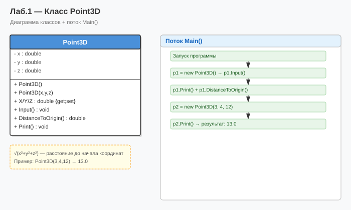

# Лабораторная работа №1 — Класс Point3D

**Тип:** Консольное приложение  
**Вариант:** 6

## Описание

Определение класса `Point3D` с тремя координатами, конструкторами и методом вычисления расстояния до начала координат.

## Как запустить

1. Открыть `Lab1_Variant6.sln` в **Visual Studio 2022**
2. Нажать **F5** (или `Ctrl+F5` без отладки)

## Схема программы

