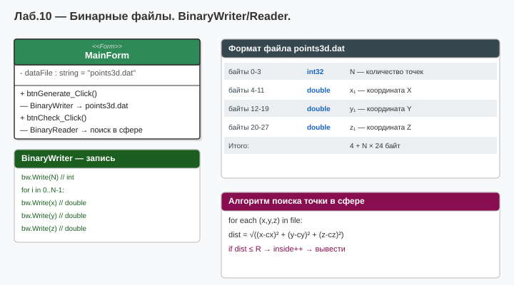

# Лабораторная работа №10 — Вариант 6
## Тема: Файлы. Потоки. Бинарное чтение/запись.

### Что нового по сравнению с ЛР №2
| Добавлено | Описание |
|-----------|----------|
| `BinaryWriter` + `BinaryReader` | Бинарная запись и чтение массива точек в `points.bin` |
| `StreamWriter` + `StreamReader` | Текстовая запись и чтение `points.txt` |
| `WriteToStream` / `ReadFromStream` | Методы в `Point3D` для сериализации |
| `using (поток)` | Автоматическое закрытие потока |

Класс `Point3D` взят из ЛР №2 без изменений в полях/свойствах;
добавлены два метода `WriteToStream` и `ReadFromStream`.

### Как запустить
1. Открыть `Lab10_Variant6.sln` в Visual Studio
2. Нажать **F5**
3. Убедиться, что в папке `bin\Debug\net8.0` появились `points.bin` и `points.txt`

### Диаграмма

