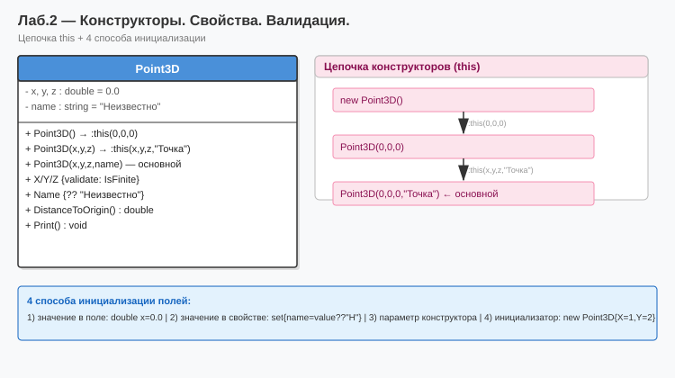

# Лабораторная работа №2 — Вариант 6
## Тема: Конструкторы. Свойства. Валидация.

### Что нового по сравнению с ЛР №1
| Добавлено | Описание |
|-----------|----------|
| Поле `name` (string) | Имя точки со значением по умолчанию «Неизвестно» |
| Цепочка конструкторов `:this(...)` | `Point3D()` → `Point3D(x,y,z)` → `Point3D(x,y,z,name)` |
| Валидация в сеттерах | `double.IsFinite()` — запрет NaN и Infinity |
| Защита от `null` | Сеттер `Name` заменяет null на «Неизвестно» |
| 4 способа инициализации | По умолчанию, конструктор, параметр по умолчанию, инициализатор объекта |
| Форматированный вывод `$"..."` | Вывод координат с точностью до 4 знаков |

### Как запустить
1. Открыть `Lab2_Variant6.sln` в Visual Studio
2. Нажать **F5**

### Диаграмма

