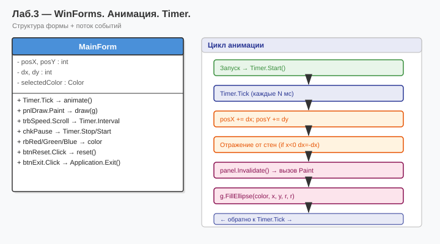

# Лабораторная работа №3 — Вариант 6
## Тема: Разработка оконного приложения. Анимация.

### Что делает программа
WinForms-приложение с анимацией движущегося объекта:
- Таймер (`System.Windows.Forms.Timer`) управляет движением
- Объект отскакивает от краёв формы
- Кнопки «Старт» / «Стоп» / «Сброс»

### Что нового по сравнению с ЛР №2
Совершенно новая тема — переход от консольного приложения к оконному (WinForms).
Консольный ввод/вывод заменён графическим интерфейсом.

### Как запустить
1. Открыть `Lab3_Variant6.sln` в Visual Studio
2. Нажать **F5**

### Диаграмма

