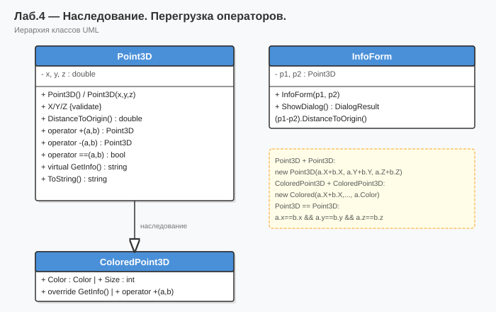

# Лабораторная работа №4 — Наследование. Перегрузка операторов

**Тип:** WinForms приложение  
**Вариант:** 6

## Описание

Класс `ColoredPoint3D` наследует `Point3D`. Перегрузка `+`, `-`, `==`, `!=`. Дочерняя форма `InfoForm`.

## Как запустить

1. Открыть `Lab4_Variant6.sln` в **Visual Studio 2022**
2. Нажать **F5**

## Схема программы

