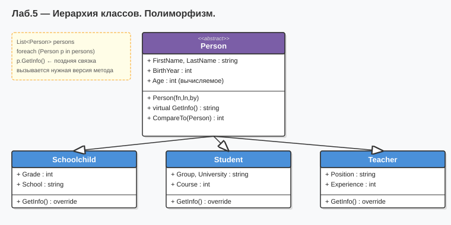

# Лабораторная работа №5 — Вариант 6
## Тема: Абстрактные классы. Виртуальные методы. Полиморфизм.

### Что нового (новая тема — переход от одного класса к иерархии)
Новая иерархия классов на основе абстрактного класса `Person`:

| Класс | Тип | Описание |
|-------|-----|----------|
| `Person` | abstract | Базовый: ФИО, год рождения, пол, `Age()`, `IsPensioner()`, abstract `GetRole()` |
| `Teacher` | конкретный | Добавляет: предмет и стаж |
| `Student` | конкретный | Добавляет: вуз и курс |
| `Schoolchild` | конкретный | Добавляет: школу и класс |

Демонстрация полиморфизма через массив `Person[]`.

### Как запустить
1. Открыть `Lab5_Variant6.sln` в Visual Studio
2. Нажать **F5**

### Диаграмма

