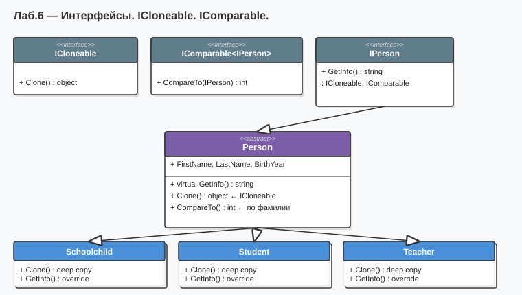

# Лабораторная работа №6 — Вариант 6
## Тема: Интерфейсы.

### Что нового по сравнению с ЛР №5
| Добавлено | Описание |
|-----------|----------|
| Интерфейс `IPerson` | Контракт: `FirstName`, `LastName`, `Age()`, `GetRole()`, `IsPensioner()` |
| `ICloneable` в `Person` | Абстрактный метод `Clone()` — поверхностная копия через `MemberwiseClone()` |
| `IComparable<Teacher>` | Сортировка учителей по стажу (по убыванию) |
| `IComparable<Student>` | Сортировка студентов по курсу (по возрастанию) |
| `IComparable<Schoolchild>` | Сортировка школьников по классу (по возрастанию) |
| `Array.Sort()` | Сортировка массивов через интерфейс `IComparable` |

Классы `Person`, `Teacher`, `Student`, `Schoolchild` перенесены из ЛР №5 и дополнены интерфейсами.  
**`Person` переименован в базовом не был** — это тот же класс из ЛР №5.

### Как запустить
1. Открыть `Lab6_Variant6.sln` в Visual Studio
2. Нажать **F5**

### Диаграмма

