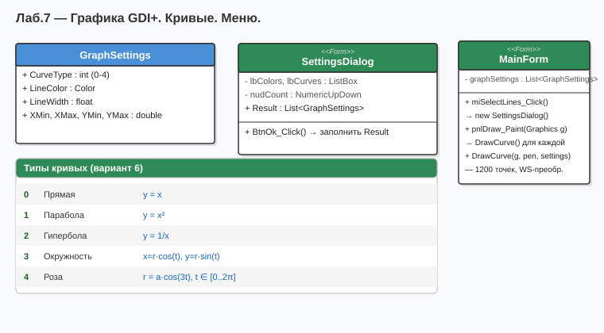

# Лабораторная работа №7 — Вариант 6
## Тема: Графика. Кривые линии (GDI+).

### Что делает программа
WinForms-приложение с рисованием кривых через `System.Drawing.Graphics`:
- Прямая линия
- Парабола
- Гипербола
- Окружность
- Роза (полярная кривая)

### Что нового по сравнению с ЛР №6
Возврат к WinForms. Новая тема — работа с графикой через `Graphics`, `Pen`, `GraphicsPath`.

### Как запустить
1. Открыть `Lab7_Variant6.sln` в Visual Studio
2. Нажать **F5**

### Диаграмма

