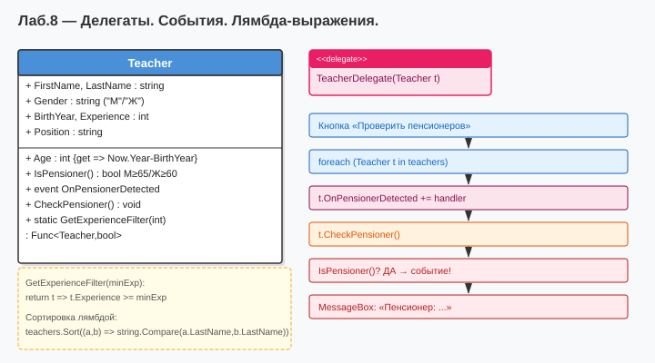

# Лабораторная работа №8 — Вариант 6
## Тема: Делегаты. События. Лямбда-выражения.

### Что нового по сравнению с ЛР №6
| Добавлено | Описание |
|-----------|----------|
| `delegate PensionerDetectedHandler` | Делегат с сигнатурой `void(Person)` |
| `event OnPensionerDetected` | Статическое событие в `Person`, срабатывает при обнаружении пенсионера |
| Подписка через `delegate(...)` | Анонимный метод-обработчик |
| Подписка через лямбду `p => ...` | Сокращённая запись обработчика |
| Делегат как переменная | `PensionerDetectedHandler myHandler = p => ...` |
| `Array.Sort` с лямбда-компаратором | `(a, b) => b.Experience.CompareTo(a.Experience)` |
| `List<T>.FindAll` с лямбдой | `p => p is Teacher` — фильтрация по типу |

Классы `Person`, `Teacher`, `Student`, `Schoolchild`, `IPerson` перенесены из ЛР №6;  
в `Person` добавлено событие `OnPensionerDetected`.

### Как запустить
1. Открыть `Lab8_Variant6.sln` в Visual Studio
2. Нажать **F5**

### Диаграмма

