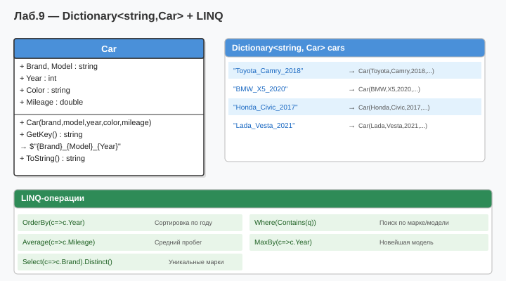

# Лабораторная работа №9 — Вариант 6
## Тема: Коллекции. LINQ.

### Что нового (новая тема)
Новый класс `Car` (Марка, Модель, Год, Скорость, Тип кузова) + работа с `Dictionary<string, Car>` и LINQ.

| LINQ-запрос | Описание |
|-------------|----------|
| `where BodyType == "Седан"` | Фильтрация по типу кузова |
| `OrderByDescending(MaxSpeed)` | Сортировка по скорости |
| `where Year > 2019 && MaxSpeed > 200` | Составное условие |
| `GroupBy(BodyType)` | Группировка по типу кузова |
| `GroupBy(Brand).Average(MaxSpeed)` | Средняя скорость по марке |

### Как запустить
1. Открыть `Lab9_Variant6.sln` в Visual Studio
2. Нажать **F5**

### Диаграмма

